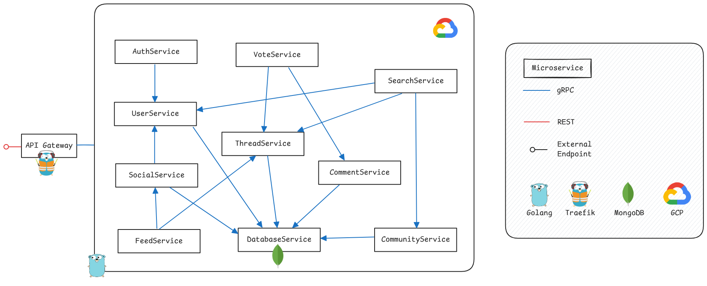

# Threadit 💬

#### Cloud Computing Project

Reddit Clone REST API with Microservices Architecture Using gRPC

---

### ☁️ Cloud Computing - Group 8
- 57551 Eduardo Proença
- 58555 Manuel Goncalves
- 64371 Ricardo Costa
- 64597 Leonardo Fernandes 

## 🚀 Overview

*Threadit* is cloud native application that offers a set of services that provide users the ability to connect, share and engage in discussions within communities through a REST API.
Its architecture follows a microservices model with gRPC communication and will be deployed on Google Cloud Platform (GCP) with Kubernetes.

## 🌐 API Description

Threadit provides a set of endpoints to interact with communities, threads, comments and more. A detailed documentation of all endpoints can be found [here](./docs/openapi).

We also make available a [collection](https://grupo-8-0813.postman.co/workspace/f8d9d9ba-0d5a-42e6-851c-c4c77649f095/collection/34079154-e136d7b1-05c1-4e8f-bcf9-00d6b3f6b65c) in postman to make it easier to test the API.

## 📦 Application Architecture

## 🔍 Development Phases

- [Phase 1 - Datasets, Business Capabilities and Use Cases](./docs/phases/phase1.md)
- [Phase 2 - API Specification](./docs/phases/phase2.md)
- [Phase 3 - Functional Requirements and Application Architecture](./docs/phases/phase3.md)
- [Phase 4 - System Implementation](./docs/phases/phase4.md)
- [Phase 5 - System Deployment](./docs/phases/phase5.md)
- [Phase 6 - Non-Functional Requirements and Technical Architecture or Big Data](./docs/phases/phase6.md)
- [Phase 7 - Implementation and Scripted Deployment of Previous Phase](./docs/phases/phase7.md)
- [Phase 8 - Automation with CI/CD](./docs/phases/phase8.md)
- [Phase 9 - System Testing](./docs/phases/phase9.md)
- [Phase 10 - Final Report](./docs/phases/phase10.md)