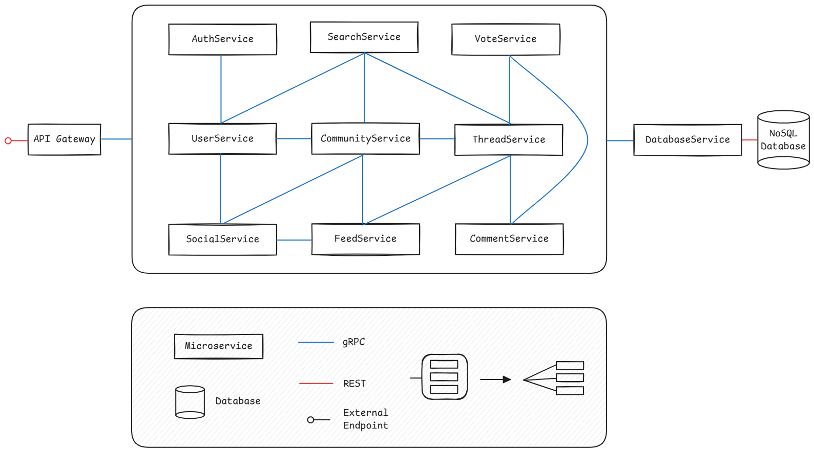

# Threadit 💬

Cloud Computing Project - Reddit Clone

---

### ☁️ Cloud Computing - Group 8
- 57551 Eduardo Proença
- 58555 Manuel Goncalves
- 64371 Ricardo Costa
- 64597 Leonardo Fernandes 

## 🚀 Overview

*Threadit* is cloud native application that offers a set of services that provide users the ability to connect, share and engage in discussions within communities through a REST API.
Its architecture will follow a microservices model and be deployed on Google Cloud Platform (GCP).

## 🔍 Development Phases

- [Phase 1](./docs/phases/phase1.md)
- [Phase 2](./docs/phases/phase2.md)
- [Phase 3](./docs/phases/phase3.md)
- [Phase 4](./docs/phases/phase4.md)
- [Phase 5](./docs/phases/phase5.md)
- [Phase 6](./docs/phases/phase6.md)
- [Phase 7](./docs/phases/phase7.md)
- [Phase 8](./docs/phases/phase8.md)
- [Phase 9](./docs/phases/phase9.md)
- [Phase 10](./docs/phases/phase10.md)

## 📦 Application Architecture

