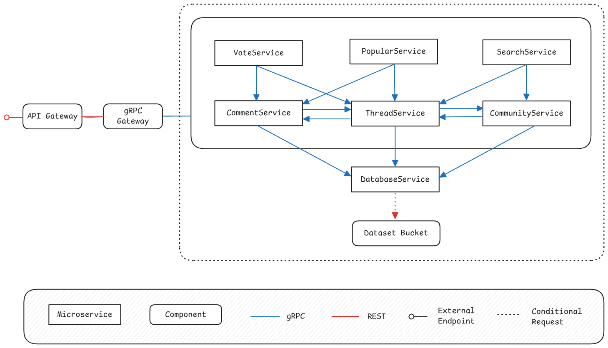

## 🔍 Phase 3 – Functional Requirements and Application Architecture

### 📌 Functional Requirements

#### 🌍 Communities
- The system should allow to list all communities, optionally by name, offset and limit.
- The system should allow to create a new community with a given name.
- The system should allow to get a community by id, with its name and number of threads.
- The system should allow to update a community's name or number of threads by id.
- The system should allow to delete a community by id.

#### 📝 Threads
- The system should allow to list all threads, optionally by community id, title, offset, limit and sort order.
- The system should allow to create a new thread with a title and content in a specific community.
- The system should allow to get a thread by id, with its title, content, community id, upvotes, downvotes and number of comments.
- The system should allow to update a thread's title, content, votes or number of comments by id.
- The system should allow to delete a thread by id.

#### 💬 Comments
- The system should allow to list all comments, optionally by thread id, offset, limit and sort order.
- The system should allow to create a new comment with content in a thread or another comment.
- The system should allow to get a comment by id, with its content, upvotes, downvotes, parent id, parent type (thread or comment) and number of replies.
- The system should allow to update a comment's content, votes or number of replies by id.
- The system should allow to delete a comment by id.

#### ⬆️ Voting System
- The system should allow to upvote or downvote a thread.
- The system should allow to upvote or downvote a comment.
- The system should allow to change or remove vote on a thread or comment.

#### 🔎 Search & Discovery
- The system should allow to search for threads by keyword.
- The system should allow to search for communities by keyword.
- The system should allow to search for both by keyword.
- The system should support pagination (offset and limit) for searches.
- The system should support sort order () for searches.

#### 🔗 Microservices Communication
- The system should enforce that all inter-service communication between microservices uses gRPC.
- The system should expose a REST API for external clients to interact with the system.

### 📦 Application Architecture

