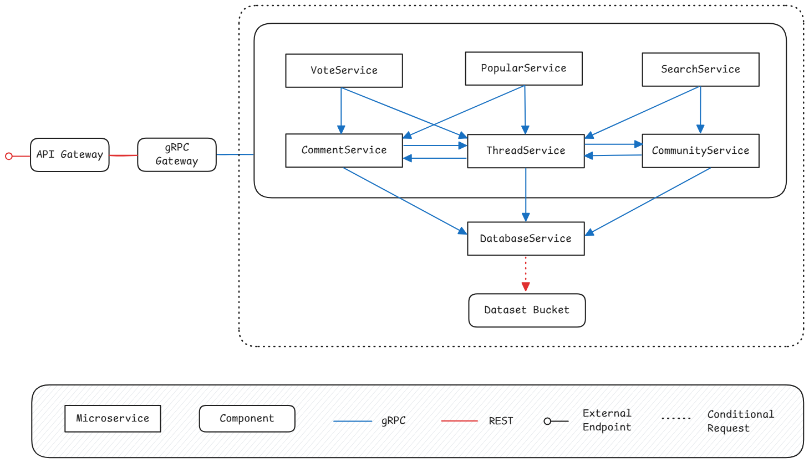

## 🔍 Phase 6 - Non-Functional Requirements and Technical Architecture or Big Data

## 1. Planned Improvements

### 1.1 API Gateway Configuration

The application will use a Traefik instance installed and configured via Helm. 
An IngressRoute and some Middlewares will be defined to ensure that Traefik routes the incoming requests to the gRPC Gateway.

### 1.2 Liveness and Readiness Probes
To improve fault tolerance and enable better self-healing behavior in Kubernetes, we will define:

* **Liveness probes** to detect and restart failed pods.
* **Readiness probes** to ensure that traffic is only sent to pods that are ready to handle requests.

### 1.3 Resource Limits and HPA
We will benchmark services to determine ideal values for:

* **CPU and memory resource requests/limits**.
* **Horizontal Pod Autoscaling (HPA)** thresholds based on real traffic patterns to ensure scalability.

### 1.5 Secret management

To further improve security we will explore Google Secret Manager for managing sensitive configuration data such as API keys, credentials and tokens. This approach provides:

- Centralized and secure secret storage.

- IAM-based access control.

- Seamless integration with GKE via workload identity.

- Versioning and audit logging for secret access.

### 1.6 CI/CD Pipeline
A continuous integration and deployment (CI/CD) pipeline will be implemented using GitHub Actions and GKE in order to automatically:

* Update OpenAPI specifications.
* Build images.
* Deploy services to the cluster.

## 2. Non-Functional Requirements
| Category        | Requirement                                                                |
| --------------- | -------------------------------------------------------------------------- |
| Scalability     | Use HPA to autoscale services based on CPU usage.                          |
| Availability    | Configure liveness/readiness probes and multiple replicas where necessary. |
| Maintainability | Implement CI/CD for consistent, automated deployments.                     |

## 3. Deployment Plan
| Step                            | Tool/Technology            |
| ------------------------------- |----------------------------|
| Containerization                | Docker                     |
| Cluster Orchestration           | Kubernetes (GKE)           |
| Ingress Management              | Traefik Ingress Controller |
| CI/CD                           | GitHub Actions             |
| Autoscaling                     | Kubernetes HPA             |

## 4. Architecture Diagram

## 5. Technical Architecture

